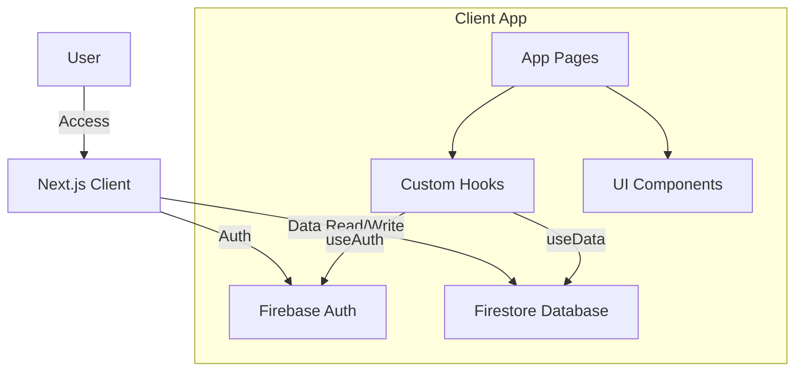
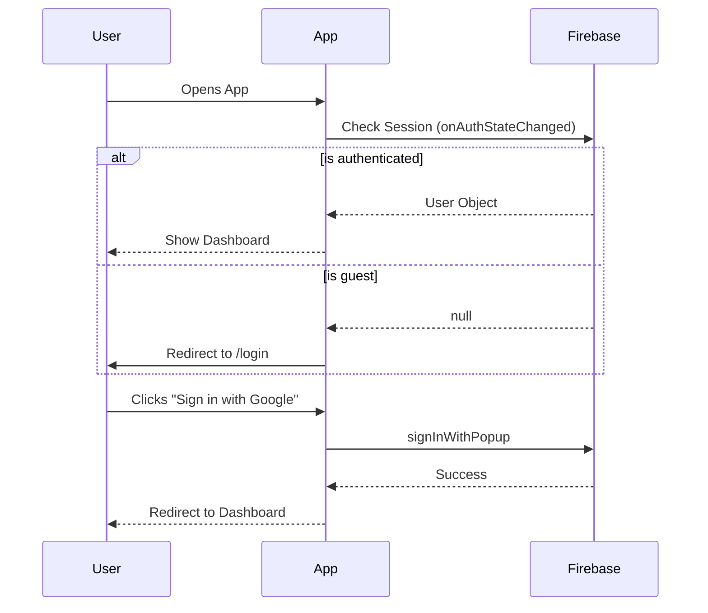

# Project Architecture

## Overview
**My Year Dashboard** is a personal tracking application enabling users to log daily activities, mood, habits, and finances.
Built with **Next.js 14 (App Router)**, **TypeScript**, and **Firebase**.

## Technology Stack
- **Framework**: Next.js 14
- **Language**: TypeScript
- **Styling**: Tailwind CSS + Shadcn UI
- **Database**: Firebase Firestore
- **Authentication**: Firebase Auth (Google)
- **Animations**: Framer Motion
- **Icons**: Lucide React

## System Architecture



## Directory Structure

| Path | Description |
|------|-------------|
| `src/app` | **Routes & Pages**. Uses Next.js App Router conventions. |
| `src/components` | **UI Components**. `ui/` contains Shadcn primitives. `layout/` has structural wrappers. |
| `src/lib/firebase` | **Firebase Logic**. `config.ts` initializes app. `auth.ts` and `db.ts` handle interactions. |
| `src/hooks` | **Logic Layer**. `use-data` (fetches logs), `use-toast` (notifications), `use-auth` (session). |

## Key Components

### 1. Authentication Flow
Managed by `src/lib/firebase/auth.ts` and `src/app/login/page.tsx`.



### 2. Data Handling (Daily Logs)
Data is structured as `LogEntry` objects stored in Firestore under `users/{uid}/logs/{dateId}`.

**Core File: `src/lib/firebase/db.ts`**
- Provides strict wrappers: `getDocument`, `addDocument`.
- **Generic Support**: `getDocument<T>` allows retrieving typed data (e.g., `LogEntry`).

**Core File: `src/app/2026/[date]/page.tsx`**
- dynamic route for specific dates.
- Fetches data on load.
- Saves entire object using `addDocument` (overwrites/updates).

## data Model (`LogEntry`)
```typescript
interface LogEntry {
  id: string;              // YYYY-MM-DD
  notes?: string;
  mood?: number;           // 1-10
  habits?: Record<string, boolean>; // { gym: true, reading: false }
  // ... metrics (expenses, readingMinutes, etc.)
}
```

## Getting Started for New Devs
1. **Environment**: Ensure `.env.local` has Firebase keys.
2. **Commands**:
   - `npm run dev`: Start local server.
3. **Adding a Feature**:
   - Create a component in `src/components`.
   - If it needs data, update `LogEntry` interface and `page.tsx`.
   - Use `use-toast` for user feedback.
